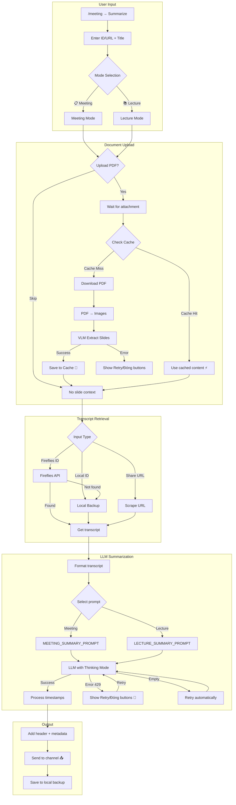

# Discord Bot

Meeting summary bot với Fireflies.ai + GLM (Z.AI).

## Features

- 🎙️ **Join Meeting** - Bot tham gia và record Google Meet/Zoom
- 📝 **Smart Summarize** - Meeting/Lecture mode với Deep Thinking LLM
- 📎 **Document Upload** - Upload PDF slides, VLM trích xuất nội dung (max 200 trang)
- � **24h Slide Cache** - Cache VLM output, skip re-processing khi retry
- � **Schedule** - Lên lịch join meeting tự động
- 📥 **Archive Backup** - Backup transcripts vào Discord channel
- 🛡️ **Whitelist** - Bảo vệ transcripts quan trọng
- 🔄 **Error Retry** - Retry buttons khi VLM/LLM gặp rate limit
- ✏️ **Edit Title** - Đổi tên transcript và re-upload backup

## Commands

| Command | Description |
|---------|-------------|
| `/help` | Hiển thị danh sách commands |
| `/config` | Cấu hình API keys, prompts (4 loại), channels, limits |
| `/meeting` | Menu với các actions bên dưới |

### Meeting Actions

| Action | Description |
|--------|-------------|
| 📋 List from Fireflies | Xem transcripts trên Fireflies (có badge 🛡️ whitelist) |
| 📥 View Backup | Xem backup transcripts với pagination và ID |
| ✏️ Summarize | Chọn Meeting/Lecture mode → Tóm tắt từ ID/URL |
| 📝 Edit Title | Đổi tên transcript, re-upload backup với tên mới |
| 🚀 Join Now | Bot join meeting ngay |
| 📅 Schedule | Lên lịch join |
| 🛡️ Manage Whitelist | Toggle bảo vệ transcripts |

### Summary Modes

| Mode | Description |
|------|-------------|
| 📋 **Meeting** | Tóm tắt cuộc họp: quyết định, action items, blockers |
| 📚 **Lecture** | Trích xuất bài giảng: khái niệm, công thức, ví dụ, Q&A |

## AI Features

| Feature | Description |
|---------|-------------|
| 🤖 **Deep Thinking** | VLM/LLM sử dụng thinking mode cho kết quả sâu hơn |
| 📄 **VLM Slide Extraction** | Trích xuất toàn bộ content từ slides (128k token budget) |
| 💾 **Prompt-aware Cache** | Cache key = filename + prompt hash (tự invalidate khi đổi prompt) |
| ⏱️ **Timestamp Links** | Tự động convert `[-123s-]` thành `[MM:SS](link)` |
| 🔄 **Retry Buttons** | Retry/Đóng buttons khi gặp lỗi rate limit 429 |

## Project Structure

```
src/
├── bot.py                 # Bot core + cog loader
├── main.py                # Entry point
├── cogs/
│   ├── meeting/           # Meeting commands
│   │   ├── cog.py         # Meeting cog + Views
│   │   ├── modals.py      # UI Modals + ErrorRetryView
│   │   └── document_views.py  # Document upload + VLM
│   └── system/            # System commands
│       ├── config.py      # Config cog + nested button views
│       └── help.py        # Help cog
├── services/
│   ├── config.py          # Guild config + 4-prompt system
│   ├── prompts.py         # Meeting/Lecture VLM/LLM prompts
│   ├── fireflies.py       # Fireflies scraper
│   ├── fireflies_api.py   # Fireflies GraphQL API
│   ├── llm.py             # GLM API (VLM + LLM with thinking)
│   ├── scheduler.py       # Meeting scheduler + cache cleanup
│   ├── slide_cache.py     # 24h slide content caching
│   └── transcript_storage.py  # Local storage + archive
└── utils/
    ├── document_utils.py  # PDF → images (max 200 pages)
    └── discord_utils.py   # Chunked message sending
```

## Meeting Summary Pipeline



## Setup

```bash
uv sync
playwright install chromium
cp .env.example .env
nano .env
uv run python src/main.py
```

## Deploy (AWS)

```bash
AWS_HOST="ubuntu@your-ip" ./deploy.sh
```

## Bot Permissions

Required Discord permissions (integer: `274877975552`):

- Send Messages, Read Message History
- Manage Messages (xóa attachments)
- Use Application Commands
- Embed Links, Attach Files

## Environment Variables

| Variable | Required | Description |
|----------|----------|-------------|
| `BOT_TOKEN` | ✅ | Discord bot token |
| `GUILD_ID` | ❌ | Test server ID (faster sync) |
| `GLM_API_KEY` | ❌* | Z.AI API key |
| `GLM_BASE_URL` | ❌ | Z.AI API base URL |
| `GLM_MODEL` | ❌ | LLM model (default: GLM-4.5-Flash) |
| `GLM_VISION_MODEL` | ❌ | VLM model (default: GLM-4.6V-Flash) |
| `FIREFLIES_API_KEY` | ❌* | Fireflies API key |

> *Can be set per-guild via `/config`

## Supported Platforms

Google Meet, Zoom, MS Teams, [+more](https://fireflies.ai/integrations)