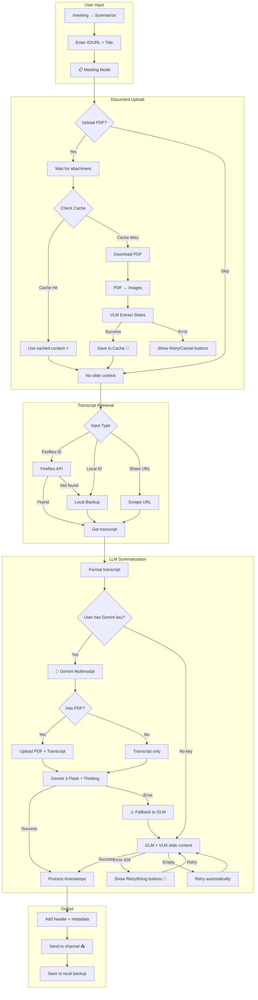
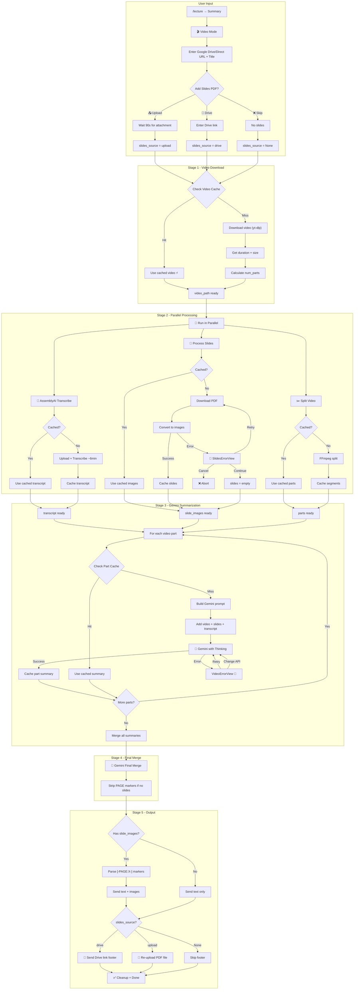

# Discord Bot

Meeting summary bot với Fireflies.ai + GLM (Z.AI) và Lecture summarization với Gemini + AssemblyAI.

**Multi-key Gemini support** - Mỗi user có thể set tối đa 5 API keys với auto-rotation khi rate limit.

## Features

### Meeting (`/meeting`)
- 🎙️ **Join Meeting** - Bot tham gia và record Google Meet/Zoom
- 📝 **Meeting Summarize** - Tóm tắt transcript với **Gemini** (priority) hoặc GLM (fallback)
- 🧠 **Gemini Multimodal** - Xử lý slides PDF + transcript trong 1 call (khi có Gemini API key)
- 📎 **Document Upload** - Upload PDF slides, tích hợp trực tiếp vào Gemini (max 200 trang)
- 📚 **Auto References** - Extract links từ PDF slides, model mô tả chức năng
- 💾 **24h Slide Cache** - Cache VLM output cho fallback GLM
- 📅 **Schedule** - Lên lịch join meeting tự động
- 📥 **Archive Backup** - Backup transcripts vào Discord channel
- 🛡️ **Whitelist** - Bảo vệ transcripts quan trọng

### Lecture (`/lecture`)
- 🎬 **Video Summarize** - Tóm tắt video bài giảng từ Google Drive/Direct URL
- 🧠 **Gemini API** - Dùng Gemini 3 Flash với Thinking Mode
- 🎙️ **AssemblyAI** - Transcribe audio từ video (~100h free/month)
- 📄 **PDF Slides** - Upload slides minh họa (Drive link hoặc file)
- 💬 **Chat Session Upload** - Upload chat .txt với Q&A, Quiz, community insights
- 📚 **Auto References** - Extract links từ PDF slides và chat, model mô tả chức năng
- 🎯 **Quiz Extraction** - Tách Q&A và Quiz riêng, giải thích đáp án chi tiết
- 🔢 **LaTeX Support** - Render block formulas $$...$$ to images, inline $...$ to Unicode
- 🔀 **Parallel Processing** - Download + Transcribe + Slides xử lý song song
- 💾 **Multi-stage Cache** - Cache video, transcript, slides, và part summaries
- 📑 **Preview Mode** - Tóm tắt nhiều PDF trước buổi học (1-5 files)

## Commands

| Command | Description |
|---------|-------------|
| `/help` | Hiển thị danh sách commands |
| `/config` | Cấu hình API keys, prompts, channels, limits |
| `/meeting` | Menu với các meeting actions |
| `/lecture` | Menu với Video/Transcript mode, Preview và API config |

### Meeting Actions

| Action | Description |
|--------|-------------|
| 📋 List from Fireflies | Xem transcripts trên Fireflies (có badge 🛡️ whitelist) |
| 📥 View Backup | Xem backup transcripts với pagination và ID |
| ✏️ Summarize | Tóm tắt từ ID/URL (Fireflies transcript) |
| 📝 Edit Title | Đổi tên transcript, re-upload backup với tên mới |
| 🚀 Join Now | Bot join meeting ngay |
| 📅 Schedule | Lên lịch join |
| 🛡️ Manage Whitelist | Toggle bảo vệ transcripts |

### Lecture Actions

| Action | Description |
|--------|-------------|
| 🎬 Record Summary | Tóm tắt từ video (Google Drive/Direct URL) với Gemini |
| 📄 Preview Slides | Tóm tắt nhiều PDF documents (1-5 files) |
| 🔑 Gemini API | Quản lý multi-key (max 5) với auto-rotation |
| 🎙️ AssemblyAI API | Set API key AssemblyAI (per-user) |

## AI Features

| Feature | Description |
|---------|-------------|
| 🤖 **Deep Thinking** | VLM/LLM sử dụng thinking mode cho kết quả sâu hơn |
| 📄 **Gemini Multimodal** | Xử lý PDF slides + transcript trong 1 call |
| 📄 **VLM Slide Extraction** | Fallback: Trích xuất content từ slides với GLM |
| 🎬 **Video + Slides + Transcript** | Gemini multimodal: video + images + text |
| 💬 **Community Insights** | Tự động lọc chat session (Q&A, Quiz, explanations) |
| 📚 **Auto References** | Extract links từ PDF/chat (Lecture + Meeting), model mô tả |
| 🔢 **LaTeX Rendering** | Block formulas → images, inline → Unicode symbols |
| 💾 **Multi-layer Cache** | Video, transcript, slides, part summaries cached |
| ⏱️ **Timestamp/Slide Links** | Convert `[-123s-]` và `[-PAGE:X-]` markers |
| 🔄 **Error Recovery** | Retry buttons + Continue/Cancel options |

## Project Structure

```
src/
├── bot.py                     # Bot core + cog loader
├── main.py                    # Entry point
├── cogs/
│   ├── meeting/               # Meeting commands
│   │   ├── cog.py             # Meeting cog + Views
│   │   ├── modals.py          # UI Modals + ErrorRetryView
│   │   └── document_views.py  # Document upload + VLM
│   ├── lecture/               # Lecture commands
│   │   ├── cog.py             # Lecture cog + API config views
│   │   ├── video_views.py     # Video processing + error views
│   │   └── preview_views.py   # Multi-doc preview processing
│   ├── shared/                # Shared UI components
│   │   └── gemini_config_view.py  # Multi-key Gemini config UI
│   └── system/                # System commands
│       ├── config.py          # Config cog + Global API keys
│       └── help.py            # Help cog
├── services/
│   ├── config.py              # Guild config + multi-key personal API
│   ├── gemini_keys.py         # Key pool + rotation + usage tracking
│   ├── discord_logger.py      # 3-channel Discord logging
│   ├── prompts.py             # Meeting/Lecture VLM/LLM prompts
│   ├── fireflies.py           # Fireflies scraper
│   ├── fireflies_api.py       # Fireflies GraphQL API
│   ├── llm.py                 # GLM API (VLM + LLM, optional)
│   ├── gemini.py              # Gemini API + personal key pool
│   ├── video.py               # Video processing (split, frames)
│   ├── video_download.py      # yt-dlp + Google Drive download
│   ├── assemblyai_transcript.py  # AssemblyAI transcription
│   ├── lecture_cache.py       # Multi-stage lecture caching
│   ├── slides.py              # PDF → images conversion
│   ├── scheduler.py           # Meeting scheduler + cache cleanup
│   ├── slide_cache.py         # 24h slide content caching
│   └── transcript_storage.py  # Local storage + archive
└── utils/
    ├── document_utils.py      # PDF → images (max 200 pages)
    └── discord_utils.py       # Chunked message sending + pages
```

## Testing

```bash
# Run all lecture tests
conda run -n rin pytest tests/lecture/ -v

# Run specific test file
pytest tests/lecture/test_chat_processing.py -v
pytest tests/lecture/test_latex.py -v
```

| Test File | Coverage |
|-----------|----------|
| `test_chat_processing.py` | Chat parsing, link extraction, filtering |
| `test_link_extraction.py` | PDF link extraction, formatting |
| `test_output_parsing.py` | Timestamp markers, page markers, multi-doc |
| `test_latex.py` | LaTeX → Unicode, image rendering |

## Meeting Summary Pipeline



## Lecture Video Pipeline



## Setup

```bash
uv sync
playwright install chromium
cp .env.example .env
nano .env
uv run python src/main.py
```

## Deploy (AWS)

```bash
AWS_HOST="ubuntu@your-ip" ./deploy.sh
```

## Bot Permissions

Required Discord permissions (integer: `274877975552`):

- Send Messages, Read Message History
- Manage Messages (xóa attachments)
- Use Application Commands
- Embed Links, Attach Files

## Environment Variables

| Variable | Required | Description |
|----------|----------|-------------|
| `BOT_TOKEN` | ✅ | Discord bot token |
| `GUILD_ID` | ❌ | Test server ID (faster sync) |
| `GEMINI_API_KEY` | ❌ | Fallback Gemini key (users set own) |
| `GLM_API_KEY` | ❌ | Z.AI API key (optional fallback) |
| `GLM_BASE_URL` | ❌ | Z.AI API base URL |
| `GLM_MODEL` | ❌ | LLM model (default: GLM-4.5-Flash) |
| `GLM_VISION_MODEL` | ❌ | VLM model (default: GLM-4.6V-Flash) |
| `FIREFLIES_API_KEY` | ❌ | Fireflies API key |

> GLM is optional - only used if `GLM_API_KEY` is configured

## Supported Platforms

Google Meet, Zoom, MS Teams, [+more](https://fireflies.ai/integrations)